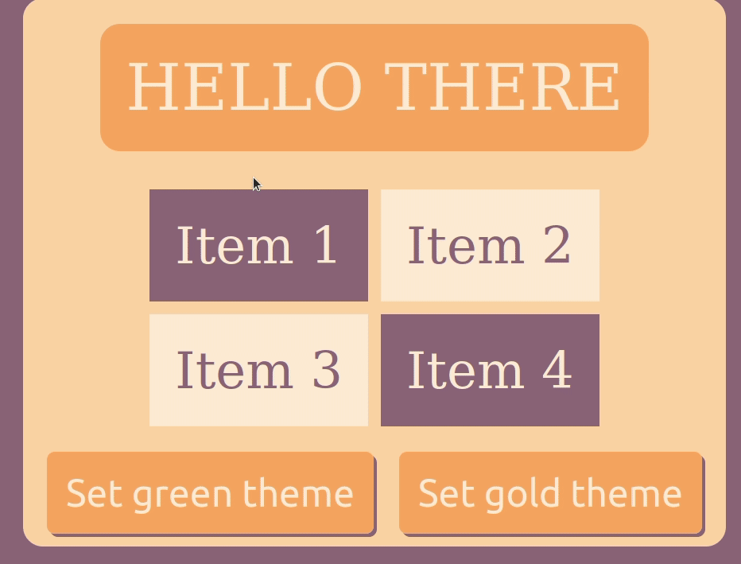

# About
## `useThemify` is a super simple and fast way to set up different themes in your react app, `Try it out!!`

# Preview


# Set up
- In your main style file (`index.css` in this example) set the name of the variables your are going to use inside `:root`. Remeber to set up default values!
```css
:root {
    --color1: #f9e6cf;
    --color2: #5ac54f;
    --color3: #33984b;
    --color4: #134c4c;
    --color5: #0c2e44;
}
```
- Create a themes.js file. Here you will write your themes: 
```JavaScript
  const themes = {
    green: {
      color1: '#f9e6cf',
      color2: '#5ac54f',
      color3: '#33984b',
      color4: '#134c4c',
      color5: '#0c2e44',
    },
    gold: {
      color1: '#ffecd6',
      color2: '#ffd4a3',
      color3: '#ffaa5e',
      color4: '#d08159',
      color5: '#8d697a',
    },
  };
```
- Copy `useThemify` and import the themes!
```JavaScript
import { useCallback } from 'react';
import themes from './themes';

const useThemify = () => {
  const applyTheme = useCallback((themeName) => {
    Object.keys(themes[themeName]).forEach((att) => {
      document.documentElement.style.setProperty(`--${att}`, themes[themeName][att]);
    });
  }, []);
  return [applyTheme];
};

export default useThemify;
```
- Import it where you need it and set the themes by name!
```JavaScript
import useThemify from "../components/themify/useThemify";
const Home = () => {
  const [setTheme] = useThemify('green'); // default theme
  ...
  ...
  ```
  ```html
  ...
  ...
  <button
    onClick={() => setTheme('green')}
  >
    Set green theme
  </button>
  <button
    onClick={() => setTheme('gold')}
  >
    Set gold theme
  </button>
```
- Remeber to use the variable names for the attributes you wish to style!
```css
.options button {
  font-size: 3rem;
  padding: 0.5em;
  border: none;
  border-radius: 10px;
  color: var(--color1); /* <--- like this! */
  background-color: var(--color3);  /* <--- like this! */
}
```
- Thats it! Have fun!  You can check the example if something is not clear!

## Author

👤 *Gabriel Rendon*

- GitHub: [@gabrielyea](https://github.com/gabrielyea)
- Linkedin [Gabriel Rendon](https://www.linkedin.com/in/gabriel-rendon-paredes/)

## 🤝 Contributing

Feel free to request changes or open issues with your suggestions and ideas!


## Show your support

Give a ⭐️ if you like this project!
